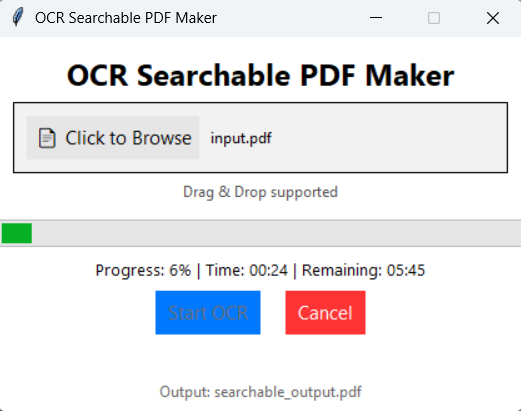

# OCR-Searchable-PDF-Tool
Convert Any PDF Into a Fully Searchable, Highlightable and Selectable Text PDF — **100% Free & Offline**

## Overview
OCR-Searchable-PDF-Tool is a powerful desktop application that converts non-searchable image-based PDFs into full searchable PDFs using Tesseract OCR — packed inside a sleek GUI & shareable as a Windows .exe. This tool works completely offline, costs zero and produces highly accurate OCR text embedded into your original PDF.

## Inspiration Behind This Project
A real incident created this idea:

**“Someone gave me a PDF and asked me to search a name inside it.
But the PDF was made from images of a Word file — so Ctrl+F didn’t work.
I tried many tools online, but most were paid or added watermarks.
At that moment, I decided to build my own OCR software — free, accurate, and easy for everyone.
Now I’m sharing it publicly as a .exe tool so no one faces the problem I faced.”**

This mindset led to the creation of OCR-Searchable-PDF-Tool — a professional Python + Tesseract project that helps thousands of users convert any PDF into a searchable format.

## Features
- **Drag & Drop PDF**: Easily drop your PDF into the window.
- **Fast & Accurate OCR**: Uses Tesseract 5 OCR with optimized settings (--oem 3 --psm 1).
- **Searchable Output**: You get a perfectly searchable, highlightable, copy-able PDF.
- **Image + Text Layer**: 
- Final PDF contains:
  * your original high-quality image
  * hidden text layer for searchability
- **Progress Bar + Time Estimate**: Track progress page-by-page.
- **Auto-close After Completion**: After success, it opens folder → shows success → closes automatically.
- **Standalone Windows EXE**: No Python required. Just download & run.

## Tech Stack
| Component          | Purpose             |
| ------------------ | ------------------- |
| **Python 3.10+**   | Core logic          |
| **Tkinter**        | GUI                 |
| **TkinterDnD2**    | Drag & Drop support |
| **PyMuPDF (fitz)** | PDF handling        |
| **Pillow (PIL)**   | Image compression   |
| **Tesseract OCR**  | Text extraction     |
| **PyInstaller**    | EXE packaging       |

## Installation (For Developers)
**1. Clone the repository**  
git clone https://github.com/sunilprajapati832/OCR-Searchable-PDF-Tool.git  
cd OCR-Searchable-PDF-Tool  

**2. Install dependencies**  
pip install -r requirements.txt  

**3. Install Tesseract OCR**  
Download Windows installer: https://github.com/UB-Mannheim/tesseract/wiki  
Then set the path in code: TESSERACT_PATH = r"C:\Program Files\Tesseract-OCR\tesseract.exe"  

## How to Use the Software (For Users)
* **Method — Direct EXE**
  * Download OCR-Searchable-PDF-Tool.exe from GitHub Releases
  * Double-click to open
  * Drag your PDF
  * Click Start OCR
  * Done — your searchable PDF appears in the same folder

## Project Structure 
OCR-Searchable-PDF-Tool/
│
├── pdf_ocr_gui.py
├── requirements.txt
├── tesseract
├── build_instructions.txt
└── README.md

## Screenshots

  
  &nbsp;&nbsp;&nbsp;
  

## How I Built the EXE (PyInstaller)
**Command used:** pyinstaller --onefile --windowed --icon=icon.ico pdf_ocr_gui.py  
**EXE is created in:** dist/OCR-Searchable-PDF-Tool.exe

## Download the EXE (GitHub Releases)
**users will click:** 👉 Releases → OCR-Searchable-PDF-Tool.exe → Download  
link: https://github.com/sunilprajapati832/OCR-Searchable-PDF-Tool/releases/tag/v1.0.0/pdf_ocr_gui.exe 

## Versioning 
For first release: **v1.0.0**

## Future Improvements (Roadmap)
 Add multi-language OCR

 Add bulk multiple-PDF processing

 Add output format selection

 Add dark/light theme toggle

 Add Mac & Linux builds

 Add an installer (.msi)

## Contributing
- Fork the repo
- Create a feature branch
- Commit changes
- Open a Pull Request

## Acknowledgements
- Tesseract OCR Team
- PyMuPDF Developers
- TkinterDnD Project
- OpenAI ChatGPT — for development assistance

## ⭐ Support the Project
If this tool helped you, please: **⭐ Star** the GitHub repo | Share the EXE link | Give feedback or request new features

## Author
**Sunil Prajapati**  
If you found this project interesting, let’s connect!  

**🎉 Thank You for Using OCR-Searchable-PDF-Tool!**
Free for everyone — built with love & passion for solving real problems.

## 🧩 Future Improvements (Roadmap)

Here are the features planned to make **OCR-Searchable-PDF-Tool** even more powerful and user-friendly:

### 🔤 Multi-Language OCR Support
- Add the ability to recognize text in multiple languages (Hindi, English, Marathi, Gujarati, etc.)
- Allow users to select languages directly from the interface.

### 📚 Bulk PDF Processing
- Enable users to upload a folder of PDFs.
- Automatically convert all of them into searchable PDFs in one click.

### 📄 Output Format Selection
- Add support for exporting:
  - Searchable PDF (current)
  - Plain text (.txt)
  - hOCR / ALTO XML
  - Word document (.docx)

### 🌗 Dark / Light Theme Toggle
- Add UI theme customization for better accessibility.
- Auto-detect system theme preference.

### 🍏🐧 Mac & Linux Executables
- Provide `.dmg` for macOS and `.AppImage / .deb` for Linux users.
- Create platform-specific build instructions.

### 📦 Windows Installer (.msi)
- Replace the standalone `.exe` with a professional installer:
  - Desktop shortcut creation  
  - Auto-update option  
  - Uninstaller support  

### 🚀 Performance Upgrades
- Faster OCR using multiprocessing.
- Better handling of large image-based PDFs.

### 🔍 Built-in PDF Preview
- Allow users to preview each page before conversion.
- Highlight the detected text layer for verification.

### 📁 Custom Output Directory
- Let users choose where converted PDFs should be saved.
- Allow auto-naming or manual naming patterns.

---

> If you want, I can also generate  
> ✔ icons  
> ✔ badges  
> ✔ section dividers  
> ✔ contribution guidelines  
> ✔ fully structured README with ToC  
> ✔ release notes  
> ✔ changelog format  

Just tell me!
